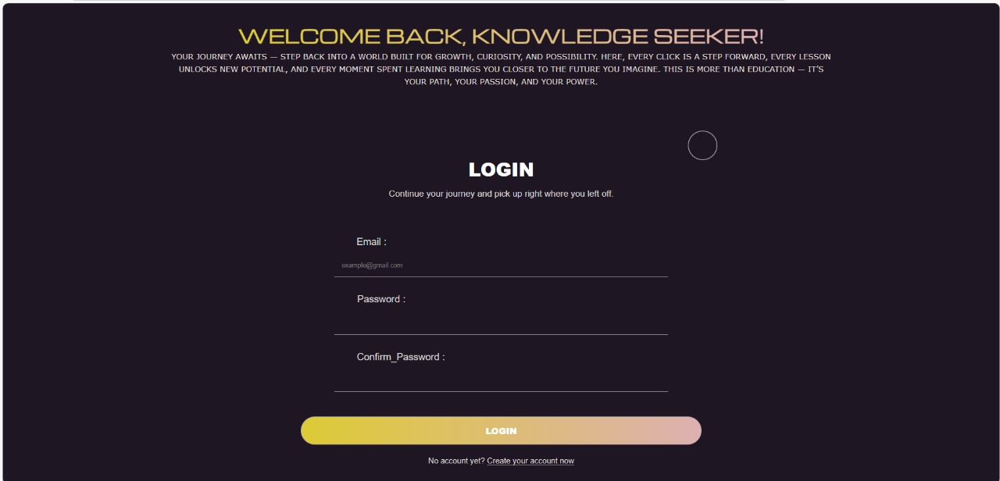
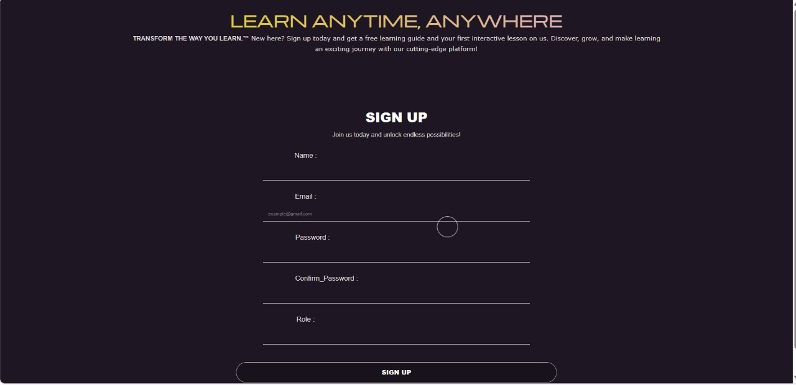
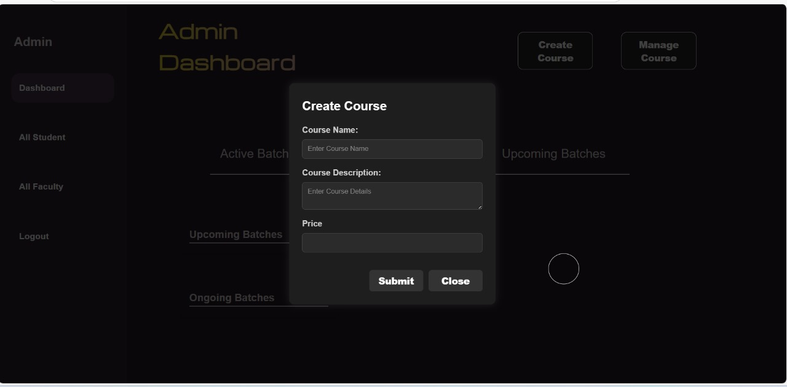
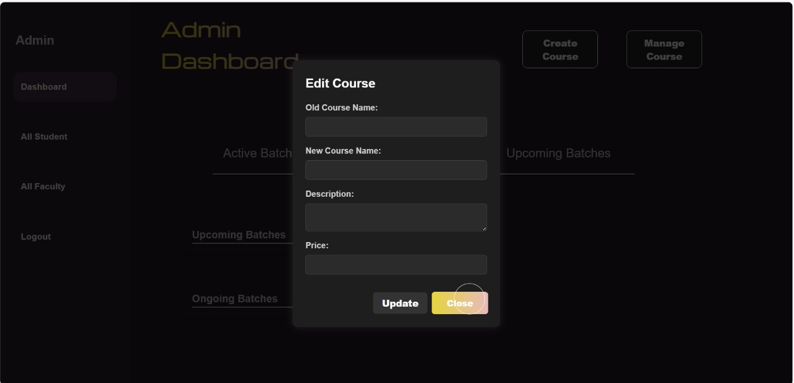
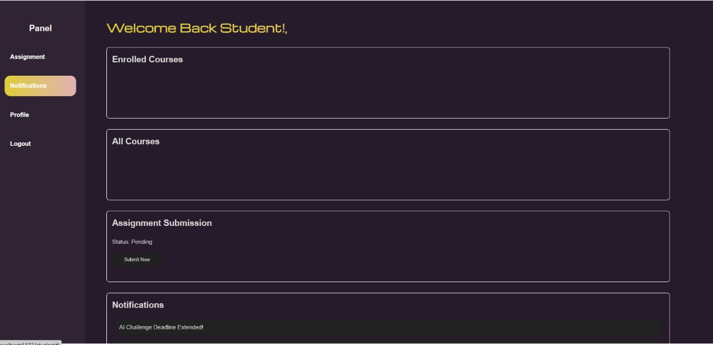
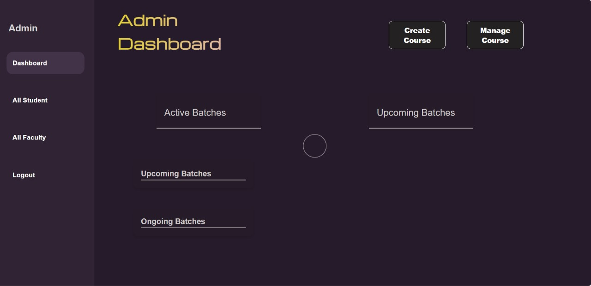

  <!-- Logo placeholder -->
  
  <h1 style="font-size: 3rem; color: #4A90E2; margin-bottom: 0.5rem;">Team Glitch</h1>
  <h2 style="font-size: 2rem; color: #333; margin-top: 0;">Centralized E-Learning Platform</h2>
  
Team #2 - Pravaah'25 - IIT Bhubaneswar

  
  

    
    
    
    
  

## 🎥 Demo

  <!-- Video placeholder -->
  
Watch our platform in action:

  
  
<i>Click the image to watch the demo video</i>

## 🌟 The Challenge

  
Challenges in Traditional E-Learning Systems:

  <ul>
    <li>Fragmented tools (Google Meet, Drive, etc.) creating disjointed learning experiences</li>
    <li>Manual progress tracking leading to inefficient performance assessment</li>
    <li>Limited real-time communication between students, faculty, and administrators</li>
    <li>No unified admin control for overseeing the entire learning ecosystem</li>
  </ul>

Our mission was to build a <strong>centralized, user-friendly e-learning platform</strong> that connects students, faculty, and administrators, enhancing communication, content delivery, and progress tracking.

## ✨ Features

  

    <h3 style="color: #4A90E2;">🧑‍🎓 For Students</h3>
    <ul>
      <li>Access to enrolled courses and learning materials</li>
      <li>Submit assignments and take quizzes</li>
      <li>Track progress and view grades</li>
      <li>Receive notifications about courses and deadlines</li>
    </ul>
  

  
  

    <h3 style="color: #5cb85c;">👨‍🏫 For Faculty</h3>
    <ul>
      <li>Create and manage courses and content</li>
      <li>Upload lectures and assignments</li>
      <li>Create quizzes and assess student submissions</li>
      <li>Send notifications to enrolled students</li>
    </ul>
  

  
  

    <h3 style="color: #f0ad4e;">👨‍💼 For Administrators</h3>
    <ul>
      <li>Comprehensive dashboard for platform overview</li>
      <li>Manage faculty and student accounts</li>
      <li>Monitor course performance and statistics</li>
      <li>Send platform-wide announcements</li>
    </ul>
  

## 📱 Screenshots

  <!-- Screenshot placeholders -->
  
  
  
  
  
  
  

## 🛠️ Architecture

  <h3 style="margin-top: 0; color: red">Frontend (Glitch)</h3>
  <ul>
    <li><strong>React</strong> - Building user interfaces</li>
    <li><strong>Vite</strong> - Fast development and optimized builds</li>
    <li><strong>CSS</strong> - Styling components for a responsive design</li>
    <li><strong>Component Structure</strong> - Login, Register, Dashboards for different user roles</li>
  </ul>

  <h3 style="color: red">Backend (web_hackathon_2)</h3>
  <ul>
    <li><strong>Node.js & Express</strong> - Server framework</li>
    <li><strong>MongoDB</strong> - Database for storing user data, courses, assignments, and more</li>
    <li><strong>JWT & bcrypt</strong> - Authentication and password security</li>
    <li><strong>REST API endpoints</strong> - Structured routes for students, faculty, and admins</li>
  </ul>

## 🚀 Getting Started

  <h3 style="margin-top: 0; color: red">Prerequisites</h3>
  <ul>
    <li>Node.js (v14 or later)</li>
    <li>MongoDB</li>
    <li>npm or yarn</li>
  </ul>

  <h3 style="color: red">Installation</h3>
  
  
<strong>Backend Setup:</strong>

  

    <code>
      # Clone the repository 
      git clone https://github.com/your-username/web_hackathon_2.git 
      cd web_hackathon_2  
      
      # Install dependencies 
      npm install  
      
      # Create .env file 
      echo "MONGODB_URI=your_mongodb_connection_string" > .env  
      
      # Start the server 
      npm run dev
    </code>
  

  
  
<strong>Frontend Setup:</strong>

  

    <code>
      # Navigate to the frontend directory 
      cd ../Glitch  
      
      # Install dependencies 
      npm install  
      
      # Start the development server 
      npm run dev
    </code>
  

## 👨‍💻 Tech Stack

  

    <h3>Frontend</h3>
    <ul>
      <li>React</li>
      <li>Vite</li>
      <li>CSS</li>
      <li>React Router</li>
    </ul>
  

  
  

    <h3>Backend</h3>
    <ul>
      <li>Node.js</li>
      <li>Express</li>
      <li>MongoDB</li>
      <li>Mongoose</li>
      <li>Express Session</li>
      <li>bcryptjs</li>
      <li>Multer (for file uploads)</li>
    </ul>
  

## 🔌 API Routes

  <h3 style="margin-top: 0;">Authentication</h3>
  <ul>
    <li><code>POST /user/signup</code> - Register a new user</li>
    <li><code>POST /user/login</code> - User login</li>
    <li><code>GET /user/auth/google</code> - Google OAuth authentication</li>
    <li><code>GET /user/auth/github</code> - GitHub OAuth authentication</li>
  </ul>

  <h3>Student Routes</h3>
  <ul>
    <li><code>GET /all</code> - Get all available courses</li>
    <li><code>POST /enroll/:courseName</code> - Enroll in a course</li>
    <li><code>POST /submit/:assignmentId</code> - Submit an assignment</li>
    <li><code>GET /quiz</code> - Get quizzes for enrolled courses</li>
    <li><code>POST /submit/:quizId</code> - Submit quiz answers</li>
    <li><code>GET /results/:quizId/:studentId</code> - Get quiz results</li>
  </ul>

  <h3>Faculty Routes</h3>
  <ul>
    <li><code>GET /admin</code> - Faculty dashboard</li>
    <li><code>POST /createCourse</code> - Create a new course</li>
    <li><code>PUT /update/:courseName</code> - Update course details</li>
    <li><code>POST /uploadAssingment</code> - Upload new assignment</li>
    <li><code>POST /create</code> - Create a new quiz</li>
    <li><code>POST /notification</code> - Send notifications</li>
    <li><code>GET /CheckAssignment</code> - View submitted assignments</li>
    <li><code>POST /checkAssignment</code> - Grade assignments</li>
  </ul>

  <h3>Admin Routes</h3>
  <ul>
    <li><code>GET /admin</code> - Admin dashboard</li>
    <li><code>GET /allStudent</code> - View all students</li>
    <li><code>GET /allFaculty</code> - View all faculty members</li>
    <li><code>POST /editBatch</code> - Edit course details</li>
    <li><code>POST /notification</code> - Send platform-wide notifications</li>
  </ul>

## 👥 Our Team

  

    
    <h3 style="margin: 0.5rem 0;">Abhinab Sharma</h3>
    
Full Stack Developer

    <a href="https://github.com/Abhinab04" style="color: #4A90E2; text-decoration: none;">@Abhinab04</a>
  

  
  

    
    <h3 style="margin: 0.5rem 0;">Arpit Mishra</h3>
    
Full Stack Developer

    <a href="https://github.com/Soap-mac" style="color: #4A90E2; text-decoration: none;">@Soap-mac</a>
  

  
  

    
    <h3 style="margin: 0.5rem 0;">Saswat Kumar Samal</h3>
    
ML Engineer

    <a href="https://github.com/Saswat-kumar-Samal" style="color: #4A90E2; text-decoration: none;">@Saswat-kumar-Samal</a>
  

  
  

    
    <h3 style="margin: 0.5rem 0;">Suman Jena</h3>
    
Developer

    <a href="https://github.com/SUMAN-JAMMY" style="color: #4A90E2; text-decoration: none;">@SUMAN-JAMMY</a>
  

## 📊 Project Structure

  <pre style="margin: 0;">
├── Glitch/ (Frontend)
│   ├── public/
│   ├── src/
│   │   ├── assets/
│   │   ├── Components/
│   │   │   ├── Login/
│   │   │   ├── Register/
│   │   │   └── WindowListener/
│   │   ├── Pages/
│   │   │   ├── Admin_Dashboard/
│   │   │   └── Faculty_Dashboard/
│   │   ├── App.css
│   │   ├── App.jsx
│   │   └── main.jsx
│   ├── index.html
│   ├── package.json
│   └── vite.config.js
│
└── (Backend)
    ├── databases/
    │   └── conn.js
    ├── models/
    │   ├── assignments.js
    │   ├── courses.js
    │   ├── notificaton.js
    │   └── user.js
    ├── routes/
    │   ├── adminRoutes.js
    │   ├── authRoutes.js
    │   ├── facultyRoutes.js
    │   └── studentRoutes.js
    ├── index.js
    └── package.json
  </pre>

## 🔒 Environment Variables

  
Create a <code>.env</code> file in the root directory of the backend with the following variables:

  
  

    <code>
      MONGODB_URI=your_mongodb_connection_string 
    </code>
  

## 🏆 Acknowledgments

  
We'd like to express our gratitude to the organizers of Pravaah'25 at IIT Bhubaneswar for this opportunity.

  
Special thanks to our mentors and judges who provided valuable feedback throughout the hackathon.

  Developed with ❤️ by Team Glitch for Pravaah'25 at IIT Bhubaneswar, 2025

